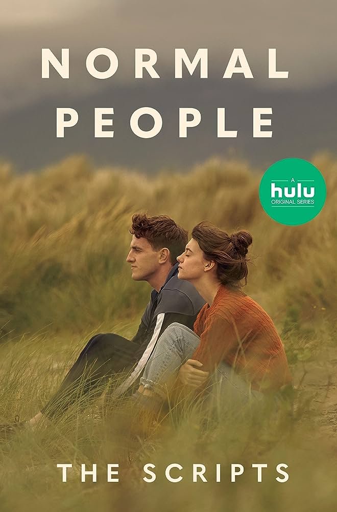

I just finished the book after about two weeks of reading it on bed, before and after sleeps. So many thoughts and emotions right now. As someone on Youtube (the trailer of this book's movie adaptation) says, read this book if you want to "feel something". I am definitely feeling a lot of things.

*The movie adaptation of the book. Looks like a nice one. Will watch it...*

**Recap of the book.** (Spoiler alert!) 
- The story starts with Connell and Marianne, two highschool students (senior year) in the same city somewhere in the UK in 2011. 
	- Connell is a popular guy by his perfect outlook -- good grades, playing middle forward in soccer team, and handsome look. However, he has an insecurity about his family as his Mom is working as a house maid in Marianne's house, while his dad left his mom before he was born. 
	- Marianne is also an academically outstanding student, but less sociable. She has insecurities about her look, her socializing ability, and her family. In fact, she is bullied both at school (where some boy called her 'flat chest') and at home (where her mom and older brother keeps accusing her for things). 
- These two teens find each other attractive, ended up having sex and stuff, but did not want to let other people know. In particular, Connell doesn't want to damage his reputation by dating a weird girl, while Marianne doesn't care about what people say and want Connell to be happy. So it was a secret. And in fact, in their minds, they are not dating (which makes me surprised). They are just liking each other, confused about themselves and each other's feelings, and ended up trying to be close friends (with benefits).
- They were choosing colleges to go, wondering about life choices. Connell ended up going to a Literature program, while Marianne went to Arts or something. Both of them went to different cities. Therefore, they kind of hibernated their half-love relationship and went to colleges. However, they always try to make their way home to meet each other.
- During the four years of college, their social status volatiled. Overall, Connell is not popular anymore, could not fit in the community, got depressed and suicidal. Whereas, Marianne first got very popular and "much prettier", but soon realized it was just an ephemeral social thing, and soon go back to depression, especially with her bad boyfriends along the way. Yes, each of them dated multiple people during college (because they are not in an official relationship), but they more or less felt that such relationships are just to "fill in the void" or to validate them as *normal people*.
- They both have some intentions about getting back to each other but did not intentionally do so because (1) they respect the other person's freedom and (2) they are not even sure what they want in life and in love.
	- But in my read, they are for each other. When they are away, their minds just malfunction. When they are together, it's like trees got watered after a long drought.
- Finally, they kind of got together again, pivoted by a night where Marianne called Connell to rescue her from being physically bullied by her brother. Being an official couple, they kissed and hugged in the middle of a party, not afraid of being known by other people, not afraid of the "abnormal" that are more in their minds than anything real.
- As a bonus, the author lets Connell win an "MFA" scholarship to New York, which seems like an excellent career opportunity for him. Their relationship is now at risk again. He says "Tell me to stay and I will". She says "Go for it. I will be here. You know it.". So a more healthy and mature relationship now, which was very hard-earned and made them cried a lot during college.

**My thoughts**

- Definitely relating a lot to my current relationship, my life, and my future career. As young people with liberal minds, I, my girlfriend, and probably many more people, find it hard just to know what we want in love, career and life. That makes us putting ourselves in undesireable (or allow me to say "suboptimal") life situations. For example, Mariannes dated with sick or sadist guys because she sees herself as a masochist (which she thinks is a degradation of hers, but I think it is okay).
- I'm quite embrassed to say this, but this book really makes me *feel more*, compared to my daily life where I basically do maths and programming.
	- I feel how depression can happen to anyone. Looks like when I am depressed, I cannot control my thoughts and emotions anymore. I hope if I ever get depressed, there will still be my loved ones to help me get through it.
	- I feel more about love and lust. And it makes me appreciate my relationship more as we were also going through hard times.
	- The book makes me want to write *sincere emails* to keep in touch with our loved ones (which should be about 3-4 people). Those email can be grammatically imperfect, but should be written with thoughts, care, offline preparation, and should show love and other subtle feelings for the recipient.
- It's been a long time since I read a book to have emotions from it.
	- Last books were [To All the Boys I've Loved Before](https://www.goodreads.com/book/show/15749186-to-all-the-boys-i-ve-loved-before) and [Once a Runner](https://www.goodreads.com/book/show/98250.Once_a_Runner)
	- The point of reading books, for me, is to *know things* and *feel things*, which is (1) an essential fuel for a fruitful life and (2) sometimes hard to have in the daily life.
	- Reading doesn't need to be formal. 
		- I don't need to read a "book"-book, like one that is visible on Goodreads. I can read a blog, a research paper, and stuffs (but better make sure the authors put efforts into the writing). 
		- I don't have to record or prove that I have read many good books. Reading many books may correlate with a person's goodness, but the point is a good person does not brag about their goodness.
		- Of course, fiction is as good as non-fiction in making life fruitful.
	- My kindle is so lovely.
	- Reading right before and after sleeps is a nice life choice.

And you? Any thoughts on this book, and on reading? 

Hope we all can feel a lot of things in life.