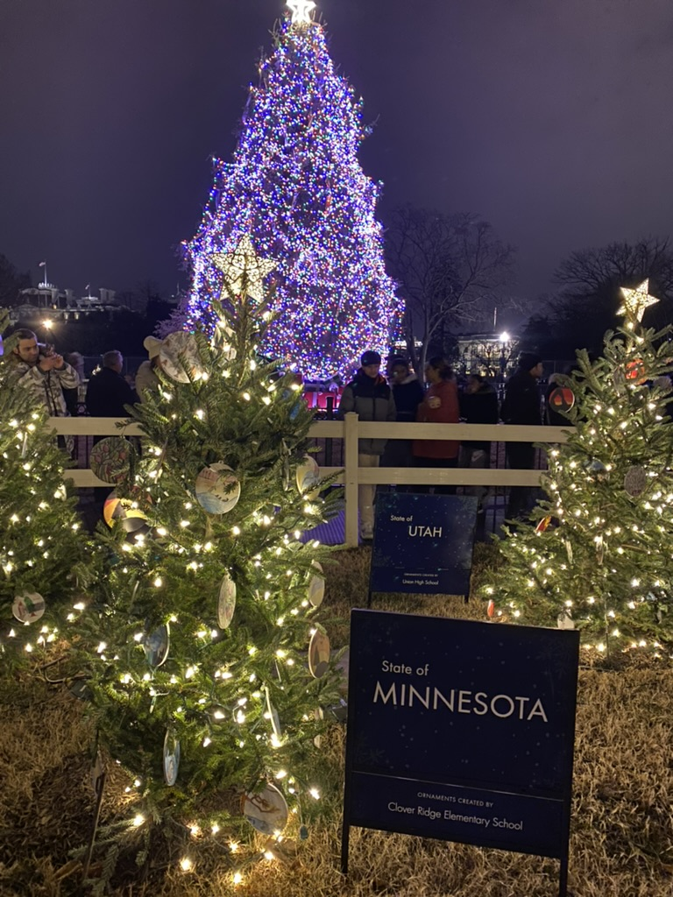
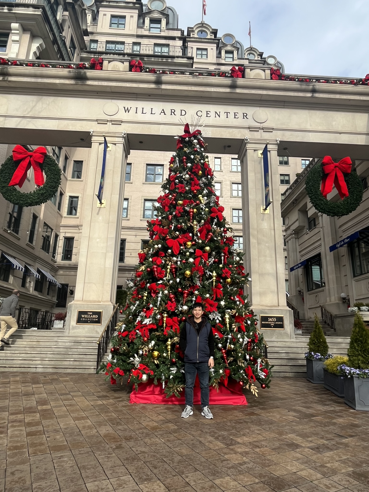
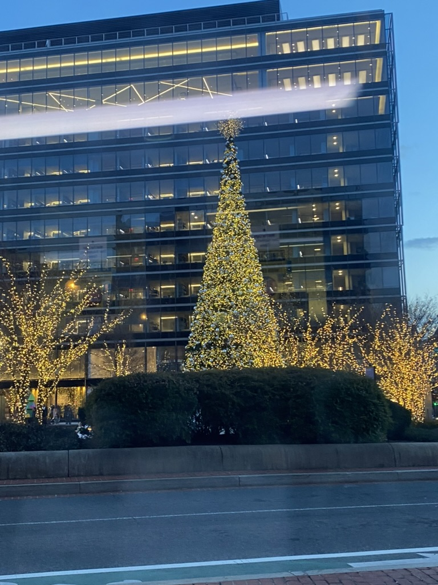
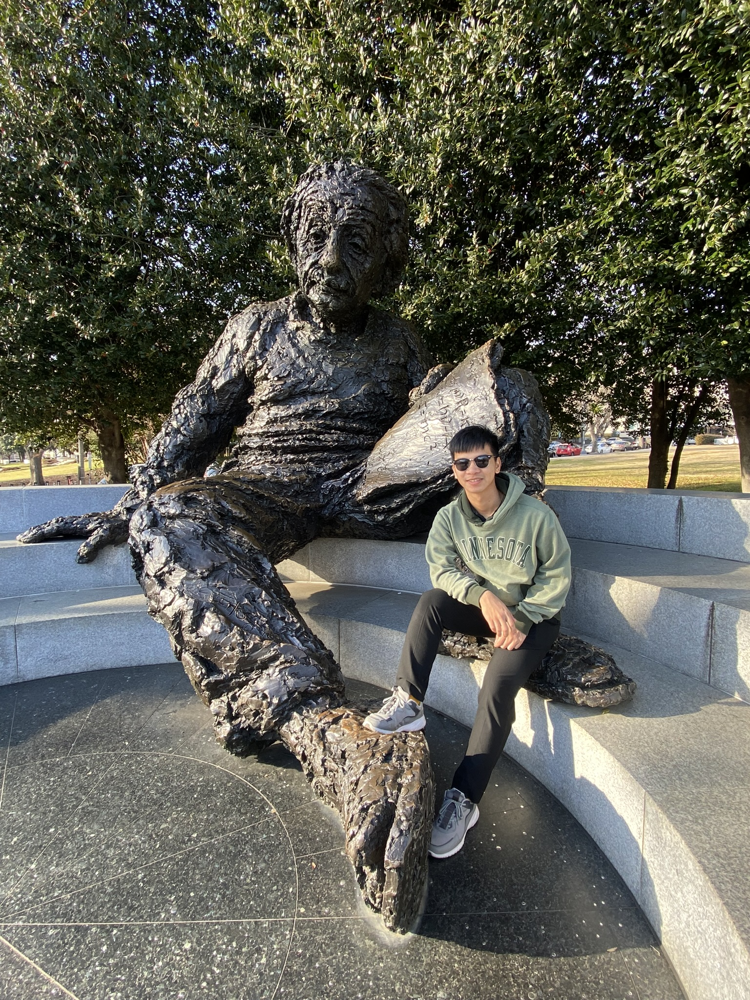
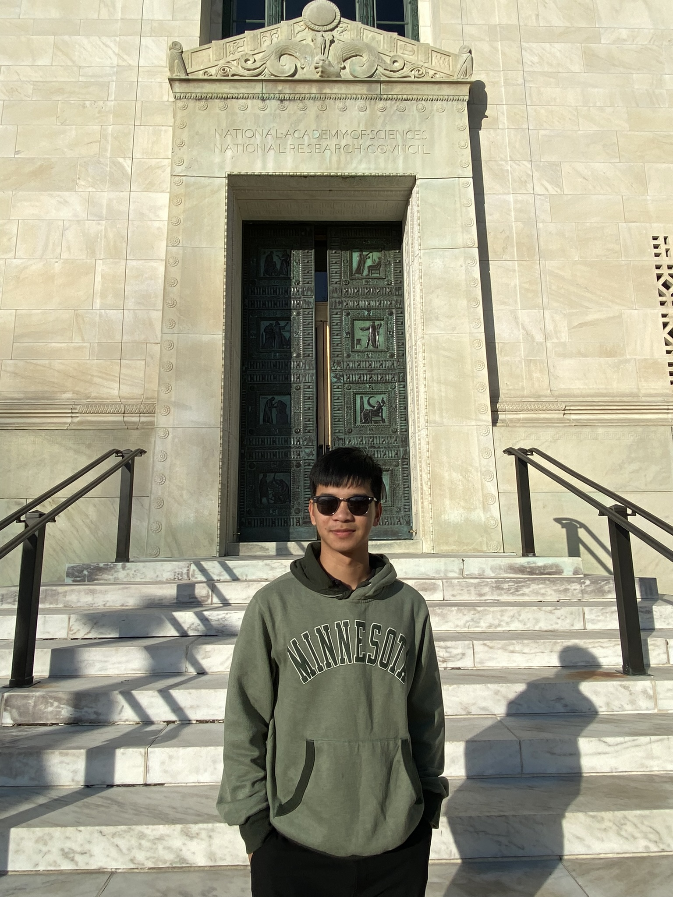
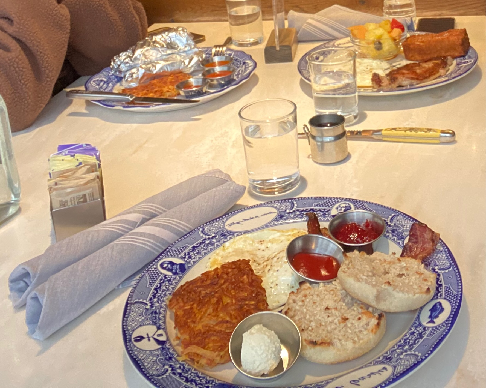
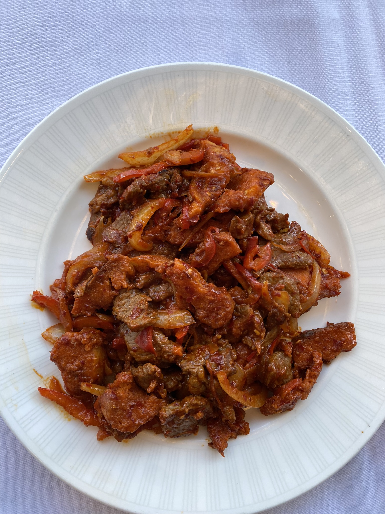
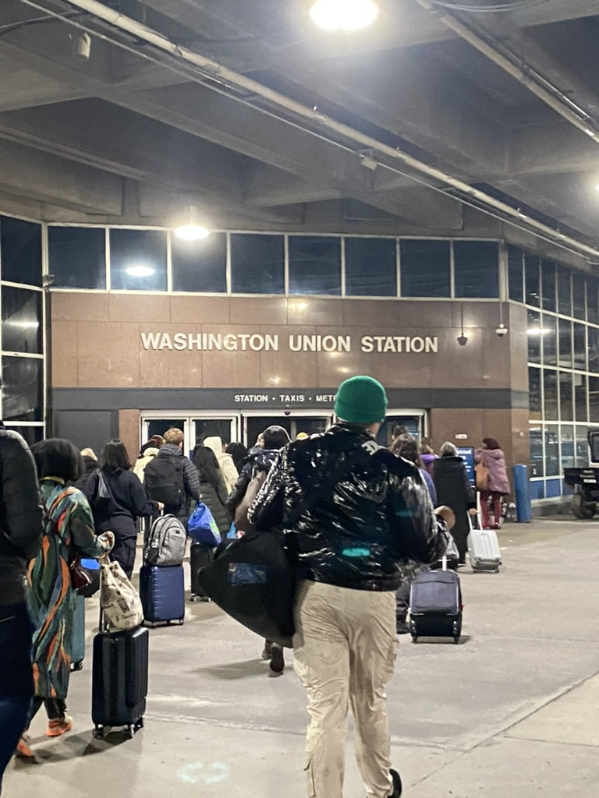
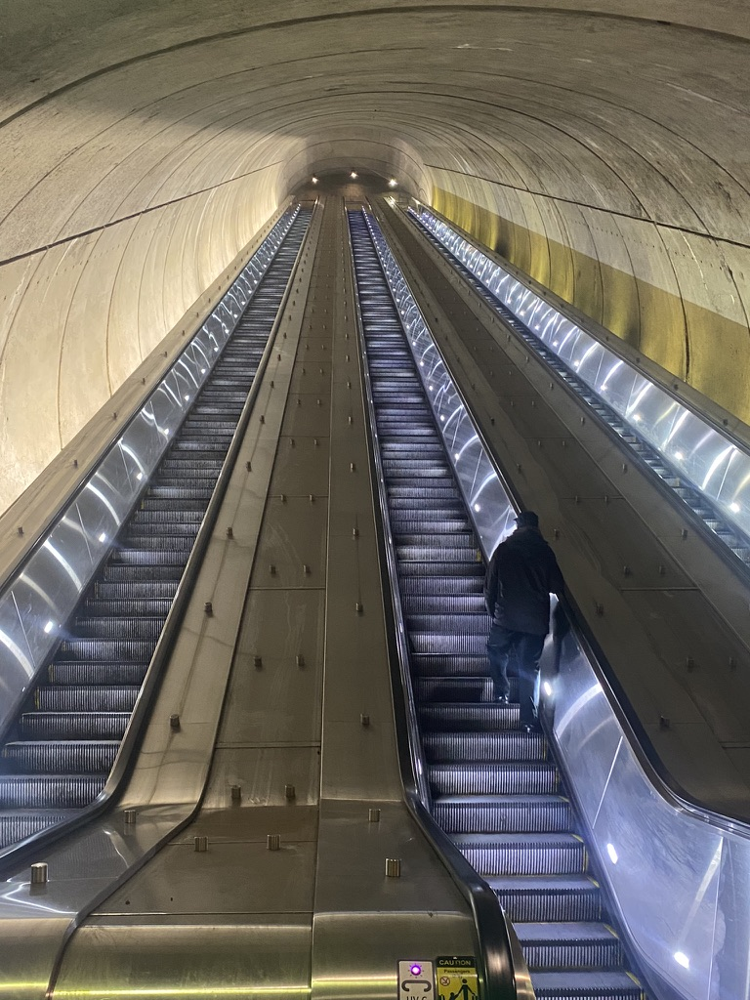

I spent the Chirstmas this year in Washington DC with my undergrad friends who are also studying in the US. It was very fun.

## Sights in the capital city of the US

The central tourist attraction is called the "National Mall". To my surprise, it is not a "mall" at all. Instead, it is an area that contains many important buildings like the White House, the Captiol, the Washington Monument, etc. 

:max_bytes(150000):strip_icc()/TripSavvy_National_Mall_In_Washington_DC_Guide_1038233_V2-45ec4b9553e44f6ea0b684c5519aac8c.png)

The saying goes "1600 Pennsylvania Ave is the most known address in the US", because it is where the president of the country is.

*The White House*

Funnily, my friend and I were pretty disappointed with the appearance of the White House. We thought it would be more beautiful. We actually thought the US Capitol was the White House. The Capitol was much prettier.

*The US Capitol*

Of course, we got excited for the christmas treees. There is a famous "National Christmas Tree" in front of the White House. It is a living palm tree, and is lighted by the president some time before every Christmas Eve. Around it are many other small trees representing the US states and territories. Aesthetically, this national tree is not as pretty as the other private trees, probably because it is harder to make a real living tree pretty.

*National Christmas Tree*

*A better tree, but fake*

*Another better fake tree*

The National Academy of Science is also in DC. I read about mathematicans and scientists heavily when I was a kid. Those biographies usually end with "he/she eventually elected to the National Academy of Science". So this place is a very sacred place to me.

*Me with Einstein*

*Me in front of (probably) the NAS building. I feel very inspired to pursue my PhD when standing here.*

## The food
Food was a major part of our trip. Generally, we enjoyed eating them. 

On the night I arrived, I ate leftovers my friends brought from [Chinatown Express](https://maps.app.goo.gl/xm2xGMTfzn2NnKxn8). This restaurant is recommended by Washington Post (?).

In the next morning, we had breakdast at [Founding Farmers & Distillers](https://maps.app.goo.gl/Ak173dyqAbPo7wmg8). They served traditional American breakfast. My friends told me it is very popular, a must-go for breakfast in DC. As I did not understand most of the menu items, I chose the first item on every section and it was not a good choice in hindsight lol. No more bacons when eating out.

*Breakfast at Founding Farmers and Distillers*

For lunch, we went to [Cho Eden Supermarket](https://maps.app.goo.gl/2nyjmd6xPFqrkFiP8), which is a Vietnamese market and restaurant area in Virginia. I was surprised to know there is a Vietnamese market here. I are pho at a small restaurant called Hoang Viet, and bought some banana sweet soup in another store, which was good.

We also dessert at [Crepaway](https://maps.app.goo.gl/ybATn1JDhkDGpsm58). The crepes are funny to eat. I had a crepe with chocolate, marshmallow and straberries inside. The food is very sticky and spilly. But we had a good time talking and meeting a new friend there.

For dinner, we ate hot pot at a restaurant in Virginia called [Mala Tang](https://maps.app.goo.gl/BWZUJaRhmnjd6gaT8). They have the typical Chinese hot pot with all types of meat. They don't have the all-you-can-eat option, so the meal was pricey. But the meat was okay. I made a bad choice of the soup because I wanted to avoid the mala one. From now on, no more bland broth!

On our last day, we woke up pretty late and only had lunch. The place was [Dolan Uyghur](https://maps.app.goo.gl/oi9kizw8FDQzbGBSA). It is located in a lovely area of Washington, where houses are closer to each other and people seem to live a normal life here, in contrast with the 'liveless' building in the center of Washington. The food here was really good and affordable. And 'Dolan' is actually a ethnic minority in the West of China that is not well-recorded in the lireature. 

*Kazan Kebab (lamb and bread) from Dolan*
## Transportation

For getting for DC from Dallas, I bought Spirit Airlines ticket via Kayak. It was only $177 for two ways, bought one month before the holiday season, which was a pretty good deal for me. People say bad things about Spirit Airlines, but for the sake of travelling, the service suffices my need.

*Spirit airlines*

For moving between cities, we used Amtrak railway. They are pretty affordable, fast, and convenient. This is my first time using long-range railroad in the US. It is holistically better than that in Vietnam lol.

*Union Station, the (main?) Amtrak station in DC*

For getting around within DC, we used Metrorail, which is a system of high-speed underground trains. They are very convenient and efficient, like the MRT system in Singapore.

*The elevator for the metro stations looking like a path to heaven*

For enjoying the streets, we walked, jay-walked, and -- especially -- Lime scooters! The scooters are abundant around the city, and riding them gives us a chance to participate in the traffic of DC and enabled visiting many more places than walking. However, the price were a bit expensive because we were not strategic about our renting time lol.

*Me on the lime scooter*

## Thoughts

One of the thing I contemplated with my friend is the nature of travels and trips. 

Because we had high hopes before visting the captial city, we were a bit disappointed after the first 12 hours as there were not so many things to 'see'. But we realized it would be unreasonable to ask a political town to offer more experience.

After that, we shifted our mindset towards experiencing *life* in city and got more fulfulling experiences. We went to see the U St area, which is not a crowded area, famous for food from the people of colors. There we can see more of the life of 'Washington people' -- the small houses, people walking and living their life. We also tried scooters, which was a very rewarding experience as mentioned above.

From now, when coming to a new city, I will keep in mind 3 aspects -- sights, food, and life. For sights, just google and go to the famous buildings and museums and I will know the formal stories of the place. For food and life, I should ask local people + reading travel guides. Also, I know having a local tour guide would help the experience a lot, but just wandering around and following our curiosity will also be a rewarding experience.