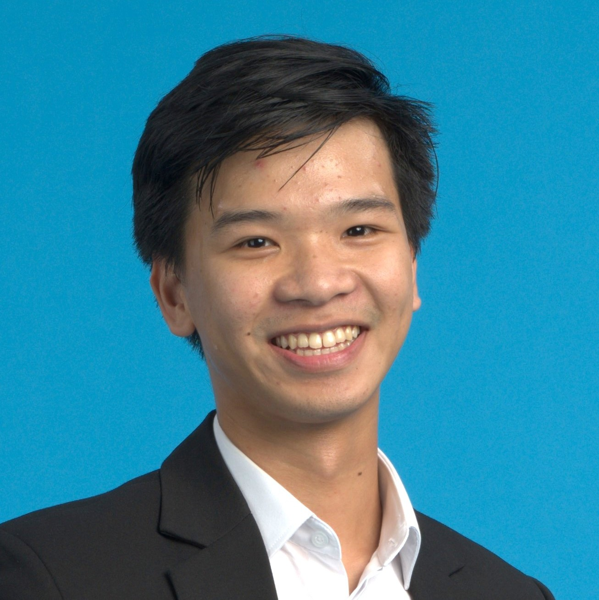

---
# Feel free to add content and custom Front Matter to this file.
# To modify the layout, see https://jekyllrb.com/docs/themes/#overriding-theme-defaults

layout: post
bibliography: pub.bib
---

Profiles: [Google Scholar](https://scholar.google.com/citations?user=-oyrpkoAAAAJ&hl=en) - [GitHub](https://github.com/npnkhoi) - [LinkedIn](https://www.linkedin.com/in/npnkhoi/)

I am Khoi, an undergrad at Fulbright University Vietnam. I am interested in studying the nature of languages and bring that into computers. I am actively looking for PhD opportunities in AI for Fall 2024.

Research interests:
1. Natural Language Processing: text embeddings, text generation, speech recognition, program synthesis, etc.
2. Computer game playing: reinforcement learning, adversarial search
3. Software Engineering by applying Machine Learning techniques

# News
- [Mar 2023] Our paper, [A Framework to Develop Automatic Speech Recognition for Low Resource Languages](https://dl.acm.org/doi/10.1145/3545947.3573271), won the Third Prize of the ACM Student Research Competition at SIGCSE TS 2023!

# Publications

N. Alemu, C. Hua, P. H. Le, **K. P. N. Nguyen**, M. Ali, and N. Veilleux, ‘A Framework to Develop Automatic Speech Recognition for Low Resource Languages’, in Proceedings of the 54th ACM Technical Symposium on Computer Science Education V. 2, Toronto ON, Canada, 2023, p. 1228.

**K. P. N. Nguyen** and R. Ramanujan, ‘Lookahead Pathology in Monte-Carlo Tree Search’, arXiv [cs.AI]. 2022.

# Other experiences
- I am currently a Research Intern at [Koidra Tech](https://www.koidra.ai/) (HCMC, Vietnam, 2022-Present).
- I did an REU with Google at the National University of Singapore (2022)/
- I was a Software Engineer Intern at [Holistics Data](https://www.holistics.io/) (HCMC, Vietnam, 2020).
- I have worked as a TA, peer mentor, and tutor in Computer Science for 3 years.
- I am the author of [OneSchedule](https://npnkhoi.github.io/oneschedule/), a website used by many students at my school FUV.
- During high school and college, I practiced Competitive Programming and competed at national and regional level. ([my CodeForces profile](https://codeforces.com/profile/pazabol))

# Featured articles
- (Vietnamese) https://zingnews.vn/day-may-tinh-trong-cay-sinh-vien-nhan-duoc-dau-tu-tu-startup-trieu-do-post1412864.html
- https://fulbright.edu.vn/fulbright-grants-first-awards-for-series-of-community-minded-projects/
- https://fulbright.edu.vn/fulbright-students-win-bronze-medal-at-icpc-asia-can-tho-regional-contest/
- (Vietnamese) https://baokhanhhoa.vn/xa-hoi/giao-duc/201505/rieng-uoc-mo-chung-dam-me-2387073/