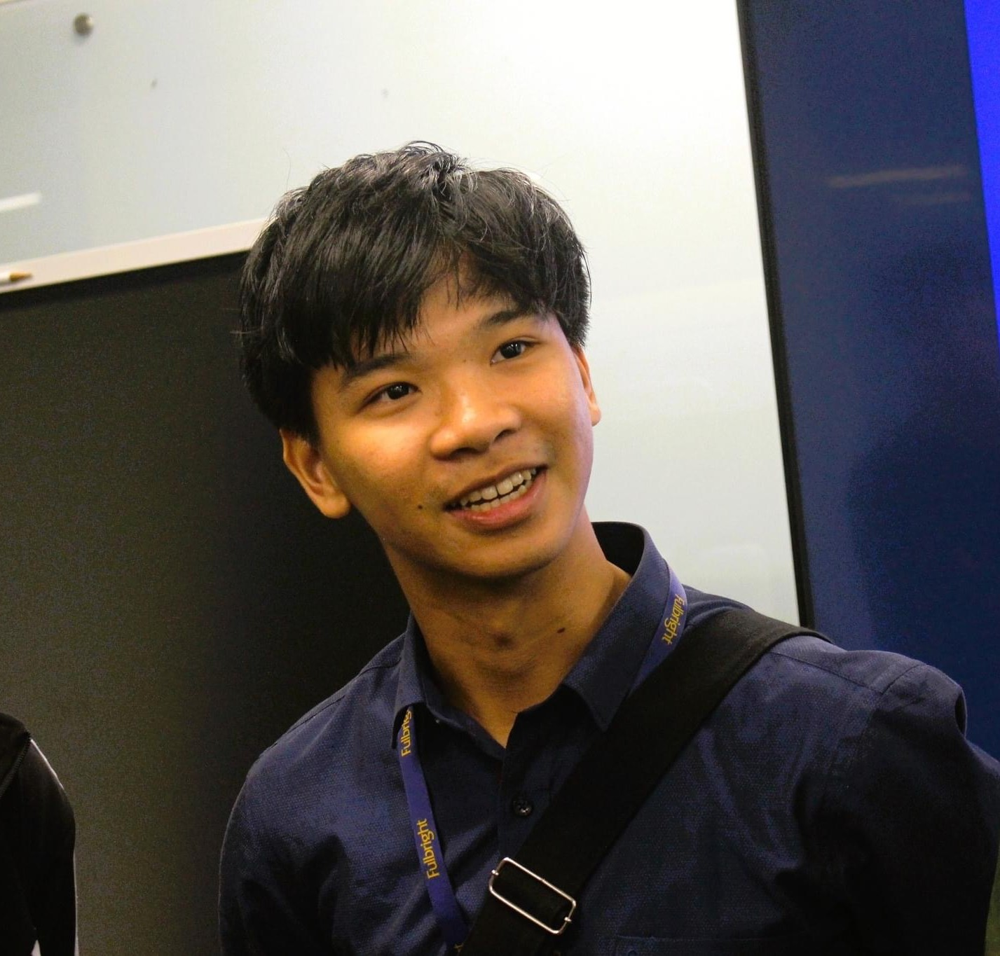

---
# Feel free to add content and custom Front Matter to this file.
# To modify the layout, see https://jekyllrb.com/docs/themes/#overriding-theme-defaults

layout: post
bibliography: pub.bib
---

Profiles: [Google Scholar](https://scholar.google.com/citations?user=-oyrpkoAAAAJ&hl=en) - [GitHub](https://github.com/npnkhoi) - [LinkedIn](https://www.linkedin.com/in/npnkhoi/)

I am Khoi, a PhD student in [Computer Science at the University of Texas at Dallas](https://cs.utdallas.edu/). I study Natural Language Processing under the supervision of [Dr. Vincent Ng](https://www.hlt.utdallas.edu/~vince/). Currently I am working on argument mining and multimodal reasoning. In the past, I also worked with [Dr. Raghuram Ramanujan](https://www.davidson.edu/people/raghu-ramanujan) on Monte Carlo Tree Search.

<!-- Research interests:
1. Natural Language Processing: text embeddings, text generation, speech recognition, program synthesis, etc.
2. Computer game playing: reinforcement learning, adversarial search
3. Software Engineering by applying Machine Learning techniques -->

# News
- [Aug 2023] I have arrived at Dallas, Texas for graduate study.
- [Mar 2023] Our paper, [A Framework to Develop Automatic Speech Recognition for Low Resource Languages](https://dl.acm.org/doi/10.1145/3545947.3573271), won the Third Prize of the ACM Student Research Competition at SIGCSE TS 2023!

# Publications

- N. Alemu, C. Hua, P. H. Le, **K. P. N. Nguyen**, M. Ali, and N. Veilleux, ‘A Framework to Develop Automatic Speech Recognition for Low Resource Languages’, in Proceedings of the 54th ACM Technical Symposium on Computer Science Education V. 2, Toronto ON, Canada, 2023, p. 1228.
- **K. P. N. Nguyen** and R. Ramanujan, ‘Lookahead Pathology in Monte-Carlo Tree Search’, arXiv [cs.AI]. 2022.

# Past Positions
- Research Intern at [Koidra Tech](https://www.koidra.ai/) (HCMC, Vietnam, 2022-2023), working on program synthesis and rule-based systems for automated farming.
- Student Researcher (with Google) at [RIPS](https://ims.nus.edu.sg/events/rips2022/), the National University of Singapore (2022).
- Software Engineer Intern at [Holistics Data](https://www.holistics.io/) (HCMC, Vietnam, 2020).
- TA, peer mentor, and private tutor in Computer Science for 3 years.
- Author of [OneSchedule](https://npnkhoi.github.io/oneschedule/), a course planning website used by many students at my undergraduate university (Fulbright University Vietnam).

# Misc
- During high school and college in Vietnam, I practiced Competitive Programming, competing at national and regional level. ([my CodeForces profile](https://codeforces.com/profile/pazabol) -- [press](https://fulbright.edu.vn/fulbright-students-win-bronze-medal-at-icpc-asia-can-tho-regional-contest/)).
<!-- - Other press: [[1]](https://fulbright.edu.vn/fulbright-grants-first-awards-for-series-of-community-minded-projects/), [[2]](https://baokhanhhoa.vn/xa-hoi/giao-duc/201505/rieng-uoc-mo-chung-dam-me-2387073/) -->